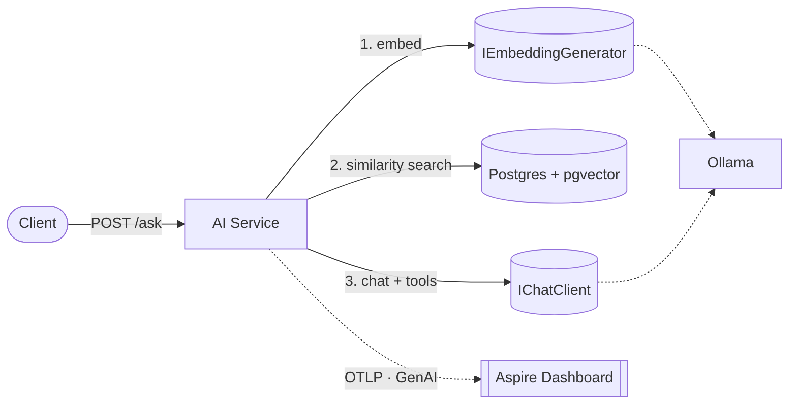

# ai-native-dotnet

> Um serviço **.NET AI-native** feito **como arquiteto, não como demo de RAG**: RAG sobre
> **pgvector**, **tool-calling**, **evals automatizadas**, **observabilidade de LLM** (OTel
> GenAI) e **provider pluggable** (Ollama local por padrão) — tudo orquestrado pelo **.NET Aspire**.

[](https://github.com/thomasmoreira/ai-native-dotnet/actions/workflows/ci.yml)

---

## A tese

A maioria dos repos de IA é "chamei a OpenAI e funcionou". Este prova as **4 coisas que
separam um engenheiro de IA arquiteto**:

1. **RAG sério** — retrieval avaliado, resposta **com citações** (anti-alucinação).
2. **Evals automatizadas** — a qualidade é **medida** (groundedness/precisão), não no chute.
3. **Observabilidade de LLM** — cada chamada é um span com **tokens, custo e latência**.
4. **Provider-agnóstico e testável** — troca o modelo numa linha; **testes determinísticos** sem chamar LLM de verdade.

Fecha o arco do portfólio: **infra distribuída** ([consistency](https://github.com/thomasmoreira/distributed-consistency-lab) · [observability](https://github.com/thomasmoreira/observability-from-scratch) · [aspire](https://github.com/thomasmoreira/dotnet-aspire-reference)) **→ IA distribuída**, reusando Postgres, Aspire e OTel. O corpus default são **os próprios docs de arquitetura do portfólio** — um serviço de IA que **explica os seus labs**.

## Arquitetura



Uma pergunta em `POST /ask` dispara o pipeline RAG: **embed da pergunta → retrieve no pgvector
(top-k) → contexto → LLM (com tool-calling) → resposta com citações**. Tudo vira **um único
trace distribuído** com tokens/custo nos spans.

## Componentes

| Peça | Papel |
|---|---|
| **AppHost** | Orquestra pgvector + Ollama + o serviço (Aspire). |
| **ServiceDefaults** | OTel + health + service discovery + resiliência. |
| **AiService** | Minimal API: `POST /ask` (RAG) + `POST /ingest`; `Microsoft.Extensions.AI`. |
| **pgvector** | Postgres com extensão `vector` — embeddings + busca por similaridade. |
| **Ollama** | Modelos locais (`all-minilm` embeddings, `llama3.2` chat); pluggable p/ cloud. |

## Sinais de arquiteto

- **Evals como gate** — qualidade medida e versionada (análogo ao SLO do lab de observabilidade).
- **Determinismo nos testes** — fake `IChatClient`/`IEmbeddingGenerator` → CI verde sem LLM externo.
- **Custo/latência observáveis** — a conversa que todo arquiteto de IA precisa ter.
- **Troca de provider sem refatorar** — `Microsoft.Extensions.AI` como abstração.

## Como rodar

**Pré-requisitos:** .NET 10 SDK e Docker (o Aspire roda pgvector e Ollama como containers).

```bash
dotnet new install Aspire.ProjectTemplates   # uma vez

# sobe pgvector + Ollama (baixa os modelos) + o serviço + dashboard
dotnet run --project src/AppHost

# indexa o corpus e pergunta
curl -X POST http://localhost:<porta>/ingest    # corpus de docs do portfólio
curl -X POST http://localhost:<porta>/ask -H 'Content-Type: application/json' -d '{"question":"O que é o Outbox no distributed-consistency-lab?"}'
```

## Verificação ao vivo

```bash
dotnet test   # sobe a app (pgvector + serviço) com fake provider — determinístico, sem LLM externo
```

## Decisões de arquitetura

- [ADR-001 — Microsoft.Extensions.AI como abstração](docs/adr/ADR-001-extensions-ai-abstraction.md)
- [ADR-002 — pgvector como vector store](docs/adr/ADR-002-pgvector.md)
- [ADR-003 — Ollama local por padrão](docs/adr/ADR-003-ollama-default.md)
- [ADR-004 — Evals como gate de qualidade](docs/adr/ADR-004-evals-as-gate.md)
- [ADR-005 — OTel GenAI semantic conventions](docs/adr/ADR-005-genai-observability.md)
- [ADR-006 — Testes com fake provider](docs/adr/ADR-006-fake-provider-tests.md)

> Modelos pequenos e locais **de propósito** — o ponto é a **engenharia** (RAG observável,
> avaliado e testável), não o modelo. A mesma arquitetura aponta para um modelo de fronteira
> trocando uma linha de configuração.

---

_Lab de portfólio. Foco: RAG, Microsoft.Extensions.AI, pgvector, evals, observabilidade de LLM e .NET Aspire._
